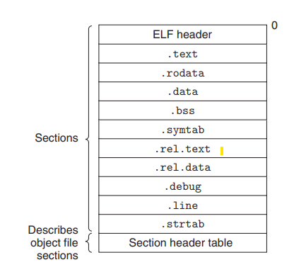
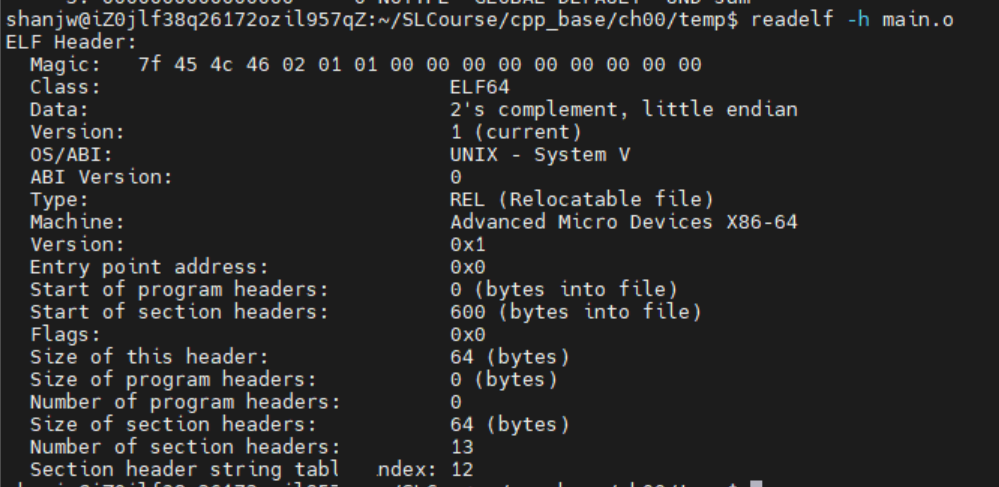
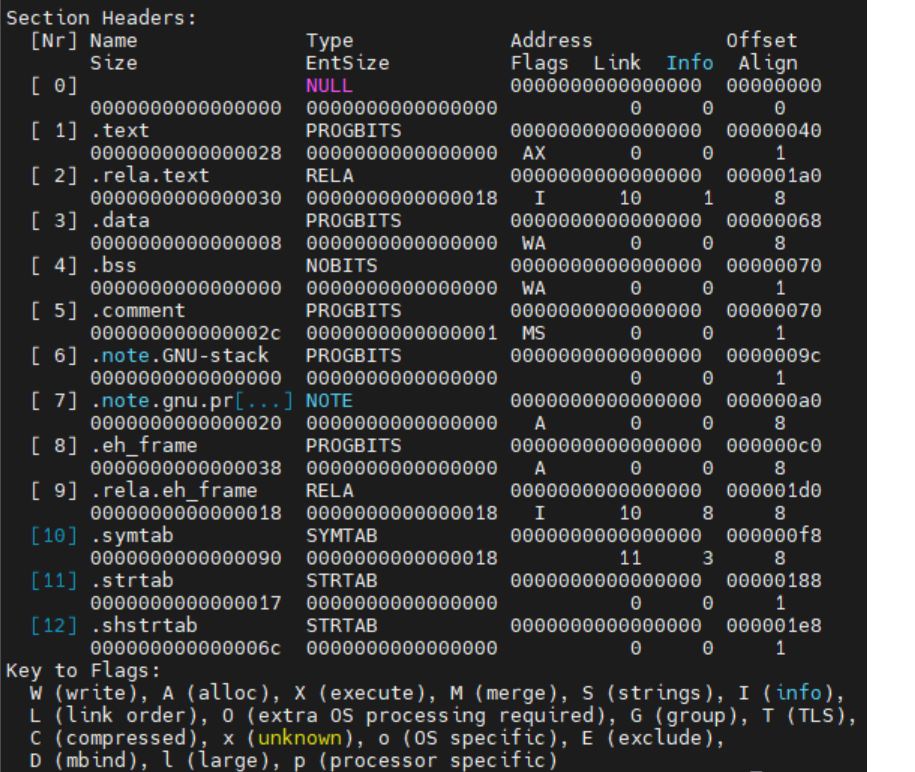

## Ch01


*UND*:undefine,指引用而未定义。main对应的是.text，说明会放在代码段，data对应.data说明放在数据段.data中。l指local只能在当前文件中看见，g指global可以在其他文件中看见。链接器只能看见global的文件，看不见local对应的东西。静态变量或函数链接时是local的，链接器看不见，所以可以定义同静态函数重名的普通函数。


指令在编译阶段就产生了，但是符号此时还未分配地址，不管是本地定义的变量如data还是引用的外部源文件sum.cpp中定义的变量gdata在代码段中其地址都是： 0.这也是*.obj( *.o)文件运行不了的原因。

### 可重定位目标文件：

+ ELF头(ELF header):16字节序列。通过命令```readelf -h main.o``` 查看main.o文件的ELF头。 

+ 

+ |        项         |                             含义                             |
  | :---------------: | :----------------------------------------------------------: |
  |   .text(代码段)   |                     已编译程序的机器代码                     |
  | .rodata(只读数据) |                           只读语句                           |
  |       .data       |              已初始化的全局且不为0的和静态c变量              |
  |       .bss        | 未初始化的或初始化为0的全局和静态c变量(不占据实际空间，运行时在内存中分配这些变量初始值为0) |
  |      .symtab      | 符号表存放程序中定义和引用的函数和全局变量信息(不包含局部变量信息) |
  |                   |                                                              |
  |                   |                                                              |
  |                   |                                                              |
  |                   |                                                              |
  |                   |                                                              |
  |                   |                                                              |
  |                   |                                                              |

  

+ 

+ 

+ 

