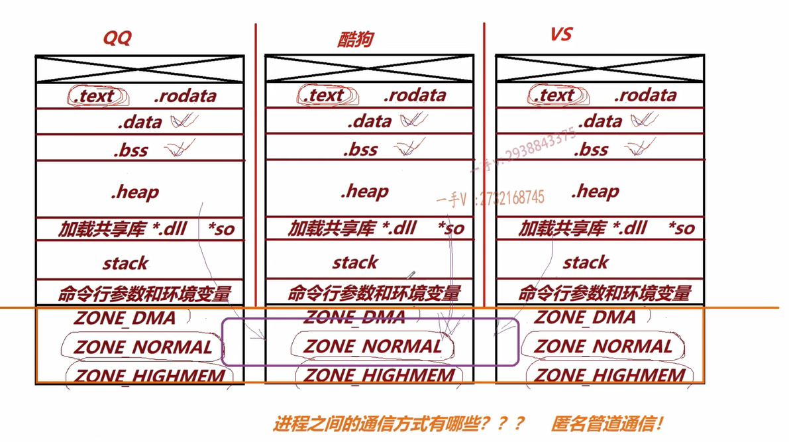
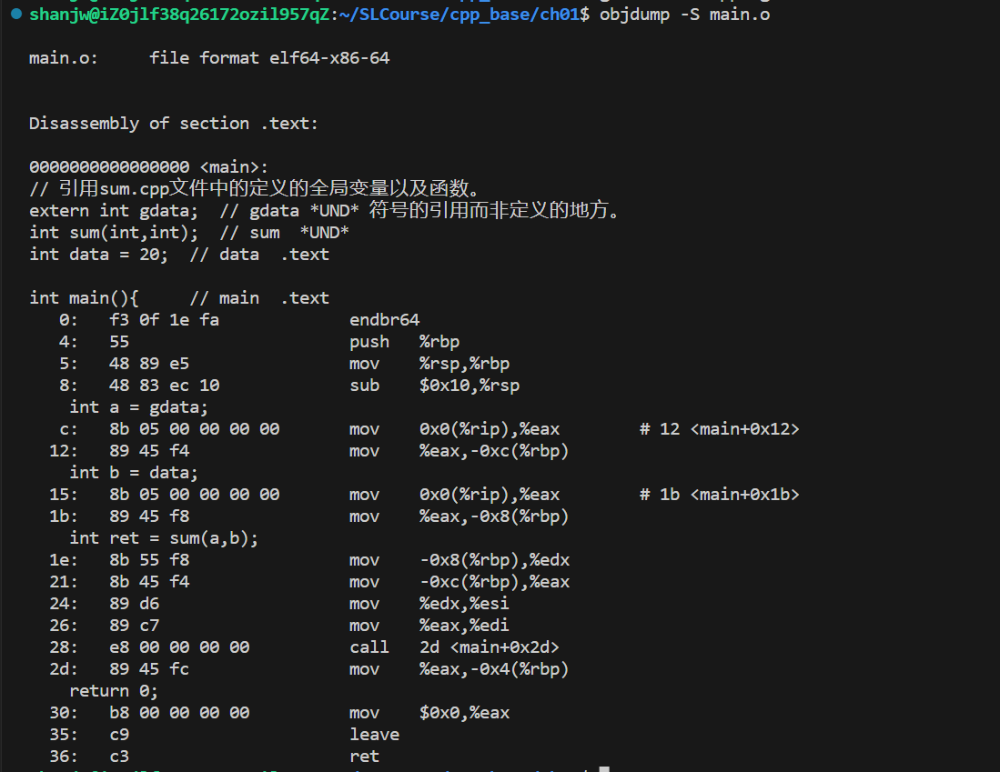
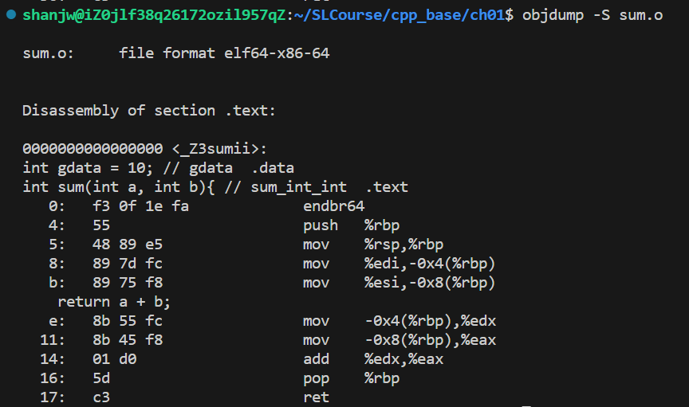

## Ch01

*UND*:undefine,指引用而未定义。main对应的是.text，说明会放在代码段，data对应.data说明放在数据段.data中。l指local只能在当前文件中看见，g指global可以在其他文件中看见。链接器只能看见global的文件，看不见local对应的东西。静态变量或函数链接时是local的，链接器看不见，所以可以定义同静态函数重名的普通函数。

指令在编译阶段就产生了，但是符号此时还未分配地址，不管是本地定义的变量如data还是引用的外部源文件sum.cpp中定义的变量gdata在代码段中其地址都是： 0.这也是*.obj( *.o)文件运行不了的原因。

