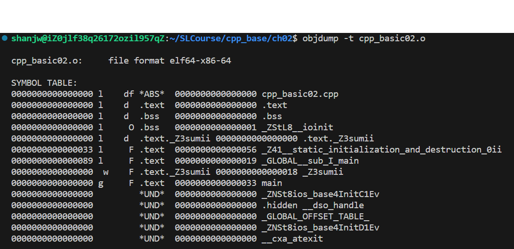
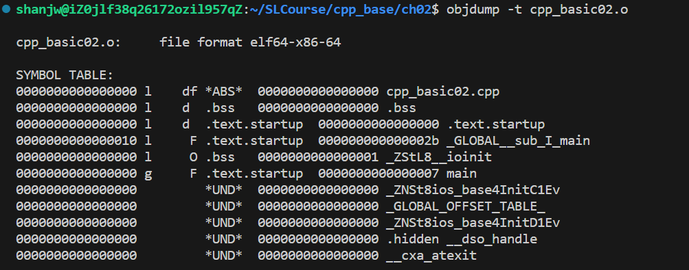

### c++基础部分：

### 1. 形参带默认值的函数：

> 总结：
>
> (1)给默认值时，从右向左给，因为压栈就是从右向左压的。
>
> (2)调用效率问题:右默认值的变量，少一句mov指令。
>
> (3)定义处和声明处都可以给形参默认值，但是无论在哪里给，定义处还是声明处，形参默认值只能
>
> 出现一次。声明时可以多次声明，但是默认值只能给一次。

```cpp
#include <iostream>
using namespace std;

int sum(int a = 10, int b = 20){
    return a + b;
}

int main(){
    int a = 10;
    int b = 20;
    int ret = sum(a,b);
    /*
        mov eax,dword ptr[ebp-8]
        push eax
        mov ecx,dword ptr[ebp-4]
        push ecx
        call sum
    */
    cout << "ret: " << ret << endl;

    ret = sum(a); // 可以看出来，变量是默认值时，少一句mov指令，调用效率高一些
    /*
        push 14H
        mov ecx,dword ptr[ebp-4]
        push ecx
        call sum
    */

    ret = sum();// 等价于sum(20,30)
    /*
        push 14H
        push 0Ah
        call sum
    */
}
```

### 2.inline函数和普通函数的区别与联系：

> (1)inline内联函数：在编译过程中就没有函数的调用开销了，在函数的调用点，直接把函数的代码进行了展开处理了。
>
> (2)inline函数不再生成相应的函数符号；`g++ -c main.cpp -O2`和`objdump -t main.o`来验证。
>
> (3)inline只是建议编译器将函数处理成内联函数，不是所有的inline都会被编译器处理成内联函数--递归.
>
> (4)debug版本中，inline不起作用，inline只有在release版本中才能出现。

```cpp
#include <iostream>
using namespace std;

inline int sum(int a = 10, int b = 20){ // *.o sum_int_int .text
    return a + b;
}

int main(){
    int a = 10;
    int b = 20;
    int ret = sum(a,b);

    /*
        sum对应的汇编指令：
        0x0000555555555183 <+26>:	mov    edx,DWORD PTR [rbp-0x8]
        0x0000555555555186 <+29>:	mov    eax,DWORD PTR [rbp-0xc]
        0x0000555555555189 <+32>:	mov    esi,edx
        0x000055555555518b <+34>:	mov    edi,eax
        0x000055555555518d <+36>:	call   0x55555555520b <_Z3sumii>
        0x0000555555555192 <+41>:	mov    DWORD PTR [rbp-0x4],eax
    */
    // 此处有标准的函数调用过程 参数压栈，函数栈帧的开辟和回退过程
    // 有函数调用的开销
    // x+y mov add mov 
}
```

debug版本inline不起作用，在符号表中仍有sum的符号：



当在编译时去掉 -g 选项是 release版本，可以看到inline在编译中直接进行代码替换，符号表中没有sum了：



### 3.VScode中查看汇编代码指令方法：

>调试模式下，在调试控制台命令行中使用下述命令查看源代码对应的汇编程序。

```cpp
/*
    vscode调试显示汇编：
        -exec disassemble /m main
        -exec disassemble /m 
    显示寄存器的值：
        -exec info registers
*/
```

### 4.函数重载：

> 定义：一组函数，其中函数名相同，参数列表的个数或者类型不同，那么这组函数就称作函数重载。函数重载又是静态(编译时期)的多态。
>
> (1)一组函数要称得上重载，一定先是处在同一个作用域当中的。注意作用域的限制，会将上层作用域的同名函数屏蔽。
>
> (2)一组函数，函数名相同，参数列表也相同，仅仅是返回值不同，不叫重载。

##### 4.1 C++为什么支持函数重载，c语言不支持函数重载？

> c++代码产生函数符号的时候，由函数名+参数列表类型组成；C代码产生函数符号的时候，由函数名来决定。

##### 4.2 C++中调用C代码以及C中调用C++代码：

> 不能直接相互调用的原因：编译时，c++和c对函数符号的命名格式不一样，导致在链接时，找不到对应的符号，从而导致链接错误：“无法解析的外部符号。”
>
> 解决方法：把C函数的声明括在 extern "C"里面。在c++源文件中将要提供给C的接口用 extern "C"括起来，使其按照C语言的规则来编译。

```cpp
#include <iostream>
#include <string.h>
using namespace std;

// c++编译器内置了 __cplusplus这个宏名
// 如果在c++中贴了这段代码则编译时会在 int sum(int a, int b)上加上相应extern "C"，那么函数的符号生成按c生成。
// 不管是c代码还是cpp代码，里面的函数都是按照c的方式编译生成的。
#ifdef __cplusplus
extern "C"{
#endif
    int sum(int a, int b){
        return a + b;
    }
#ifdef __cplusplus
}
#endif

bool compare(int a, int b){
    cout << "compare_int_int" << endl;
    return a > b;
}

bool compare(double a, double b){
    cout << "compare_double_double" << endl;
    return a > b;
}

bool compare(const char* a, const char* b){
    cout << "compare_char*_char*" << endl;
    return strcmp(a,b) > 0;
}

int main(){
    // bool compare(int a, int b); 函数声明,作用域使得下面两个函数之间调用compare_int_int函数了。
    compare(10,20);
    compare(10.0,20.0); // warning:精度丢失
    compare("aaa","bbb"); // error:无法将const char* 转化到 int 
    return 0;
}
```

### 5. const，指针，引用，在函数当中的引用：

#### 5.1 const怎么理解，c和c++中的const的区别：

> const修饰的变量不能再作为左值使用，初始化完成后，值不能被修改。
>
> C语言：
>
> ​	(1)const修饰的量，可以不用初始化，但是后面也不能再作为左值使用赋值了。
>
> ​	(2)C中，const修饰的变量不叫作常量，叫做常变量。const只是从语法上说明a是左值不能修改，实际上是可以修改的，通过指针。
>
> C++语言：
>
> ​	(1)const修订的量必须初始化，叫做常量。
>
> ​	(2)如果const修饰的变量初始化时是由一个变量初始化的，此时退化成常变量。
>
> **根本原因：** const在c和c++的编译方式不一样，在c中，const修饰的量就是当作一个变量来编译生成指令的。c++中，所有出现const常量名字的地方，都被常量的初始化值替换了。

```cpp
#include <iostream>
#include <typeinfo>
int main(){
    // const int a; error: uninitialized ‘const a’ const修饰的变量必须被初始化。

    // const int a = 20;
    // int array[a] = {};

    // int* p = (int*)&a;
    // *p = 30;

    // // 20 30 20
    // printf("%d %d %d \n", a, *p, *(&a));

    int b = 20;
    const int a = b; // a退化成常变量了，不是常数了，所以不能定义数组了，与c语言中一样。
    //int array[a] = {};
    return 0;
}
```


